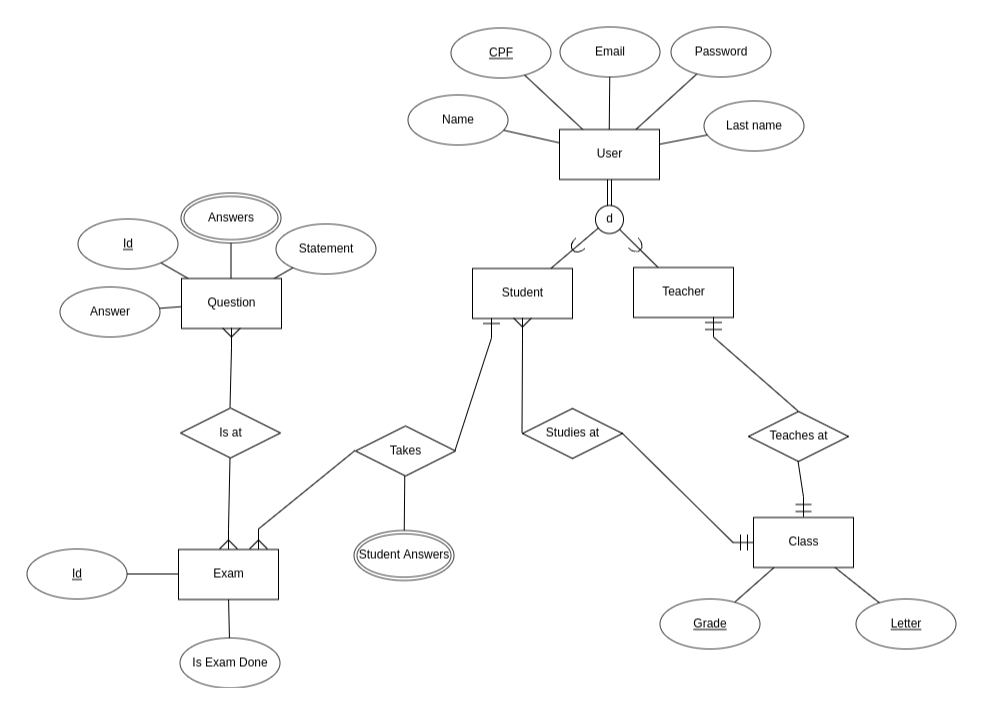

## What is this repository about

This repository holds the final project for the database course in my computer engineering program. Within it, an API was constructed for a database representing a virtual school, utilizing the Django REST framework. The entity-relationship model can be viewed in the image below.



## How to setup

Firstly, make sure to have PostgreSQL installed on your machine. Next, create a database named 'school,' along with a user 'school' and password 'school.' Following that, at the project's root, establish a Python virtual environment and install the required dependencies using the command below

```
$ python -m pip install -r requirements.txt
```
After that you should be good to run!